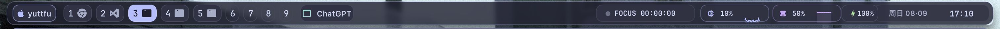

# yuttfu dotfiles

一套可迁移的 macOS 桌面环境：AeroSpace 管理窗口，SketchyBar 负责顶部状态栏，JankyBorders 标出当前窗口；Ghostty 和 Visual Studio Code 使用克制的玻璃透明效果。

它只包含已经整理、验证过的配置；未完成的工具不会被迁移脚本安装或覆盖。

## SketchyBar 学习仪表台



这条顶部栏围绕学习、开发和录制设计，使用 Catppuccin Mocha 配色、圆角半透明背景和刘海安全布局。所有常用信息都放在屏幕两侧，中间区域保持干净。

| 区域 | 组件 | 作用 |
| --- | --- | --- |
| 左侧 | ` yuttfu` | 打开系统设置，也是整套配置的身份标记。 |
| 左侧 | AeroSpace 工作区 | 显示 1–9 号工作区及其中的应用图标；点击数字即可切换。 |
| 左侧 | 当前应用 | 实时显示正在使用的应用，录制时也能清楚交代上下文。 |
| 右侧 | `FOCUS HH:MM:SS` | 面向学习的正计时器；点击后可以开始、暂停和复位。 |
| 右侧 | CPU / RAM | 分开显示实时占用百分比和短曲线，高负载时才提高警示色。 |
| 右侧 | OBS | 仅在录制相关状态下提示，避免忘记录制或误以为仍在录制。 |
| 右侧 | 电池 | 正常状态保持低对比度，接电显示绿色闪电，低电量显示红色提醒。 |
| 右侧 | 日期 / 时钟 | 日期点击后打开本地事件月历，时钟保持固定宽度以避免界面跳动。 |

日期组件调用的是无 Dock 图标的本地月历，而不是 Apple Calendar。月历使用固定 7×6 网格；有事件的日期显示红点，点击某天后会在月历上方展开当天事件。每天可保存多条“可选时间 + 标题”事件并逐条删除，数据只保存在：

```text
$HOME/Library/Application Support/yuttfu-sketchybar/calendar-marks.json
```

完整的 `./bootstrap.sh --apply` 会构建并安装 `$HOME/Applications/yuttfu Calendar.app`；`--links-only` 不会触发 Swift 构建。修改日历源码后也可以单独重建：

```bash
bash macos/yuttfu-calendar-panel/build-app.sh "$HOME/Applications/yuttfu Calendar.app"
```

> [!NOTE]
> Ghostty 与 Zsh/Starship 已完成首轮整理；Zellij 和 Neovim 仍在规划中，后续会继续统一终端复用与编辑器体验，敬请期待。

## 在新 Mac 上恢复

1. 先安装 Xcode Command Line Tools 和 [Homebrew](https://brew.sh/)，然后克隆这个仓库。
2. 进入仓库，先做只读检查：

   ```bash
   ./bootstrap.sh --check
   ```

3. 检查通过后，安装依赖、创建配置链接，并恢复已记录的 VS Code 扩展：

   ```bash
   ./bootstrap.sh --apply
   ```

   安装脚本会在发现已有的用户配置与本仓库冲突时停止，不会覆盖它。若只想创建链接、且不安装 Homebrew 软件包和扩展，可使用：

   ```bash
   ./bootstrap.sh --apply --links-only
   ```

4. 首次启动 AeroSpace、SketchyBar 和 JankyBorders 时，按 macOS 的提示授予所需权限；AeroSpace 通常需要辅助功能权限。

## 防止 Codex 工作时过快睡眠

下面的电源档位已经按这台 Mac 的使用方式设计：接电时关闭系统自动睡眠但保留 30 分钟熄屏；电池时 10 分钟熄屏、15 分钟睡眠。先查看当前值：

```bash
./macos/power.sh --check
```

先预览会执行的管理员命令：

```bash
./macos/power.sh --apply --dry-run
```

确认后再真正应用：

```bash
./macos/power.sh --apply
```

日常只希望 Codex 不中断，可以临时保持系统唤醒三个小时：

```bash
codex-awake --minutes 180
```

`bootstrap.sh` 会把这个工具链接到 `$HOME/.local/bin/codex-awake`。如果你的 shell 尚未把该目录放入 `PATH`，请直接运行 `$HOME/.local/bin/codex-awake --minutes 180`，或自行将该目录加入 shell 的 `PATH`。需要同时阻止显示器熄屏时，额外传入 `--display`；合盖和手动睡眠仍然有效。

## Ghostty 与 Visual Studio Code 透明效果

Ghostty 的主题、字体和透明度由仓库中的配置直接控制。它使用 Catppuccin Mocha、MesloLGS NF、macOS regular glass 和 `0.72` 不透明度，让背景明显通透，同时通过原生模糊保持文字可读。

Visual Studio Code 底部集成终端固定为 `/bin/zsh` 登录 shell，使用 MesloLGS NF、14 号字与方块光标。shell、字体和布局等核心设置通过 `workbench.settings.applyToAllProfiles` 同步到所有 VS Code Profile，但不设置 `workbench.colorCustomizations`；终端颜色继承当前 Profile，Background 壁纸模拟透明效果不会被额外背景色遮挡。

由于它会改动 VS Code 的应用资源，玻璃效果必须在 VS Code 内手动确认：安装完成后打开命令面板，运行 **Vibrancy Continued: Enable Vibrancy**。VS Code 更新后若效果失效，再运行 **Vibrancy Continued: Reload Vibrancy**。这是刻意保留的显式操作，避免迁移脚本静默修改应用包。

## Zsh 与 Starship

Ghostty 和 VS Code 集成终端共用仓库中的原生 Zsh 配置，但使用两个同色系的 Starship 布局。Ghostty 保留完整 Catppuccin Powerline，按场景显示 Git、C/C++、Python、Node.js、Conda 和命令耗时；VS Code 底部终端自动切换到 `starship-vscode.toml`，只保留用户名、缩短目录、Git、Conda 和时间，避免在狭面板中拥挤。VS Code 中只要仓库存在未提交改动，就显示一个红色 `●`，仓库干净时隐藏；具体改动数量使用 `git status` 查看。

Conda 的 `base` 自动激活已经关闭，Conda 也不会自行修改提示符。进入 AI 环境时手动执行：

```bash
conda activate <环境名>
```

Starship 会显示当前环境一次。私有代理、API 配置或仅当前机器需要的路径可以放进不受 Git 管理的 `$HOME/.zshrc.local`。

当前 Mac 首次切换到仓库配置前，应先备份已有的 `.zshrc`、`.zprofile`、`.condarc` 和 `.config/starship.toml`。迁移后的文件由 Stow 链接，包括 VS Code 专用的 `.config/starship-vscode.toml`；新 Mac 执行正常的 `./bootstrap.sh --apply` 即可恢复。

## Google Chrome 配色

Chrome 使用官方 Catppuccin Mocha 主题统一标签栏、地址栏和新标签页的基础颜色。主题安装需要在 Chrome 中手动确认，仓库不保存浏览记录、Cookie 或个人 Profile。主题链接、恢复方式和安全边界见 [Chrome 配色指南](chrome/README.md)。

## 本地验证

```bash
bash tests/test_desktop_shell.sh
bash tests/test_status_widgets.sh
bash tests/test_calendar_panel.sh
bash tests/test_glass_effects.sh
bash tests/test_shell_stack.sh
bash tests/test_bootstrap.sh
bash macos/yuttfu-calendar-panel/test-core.sh
```
