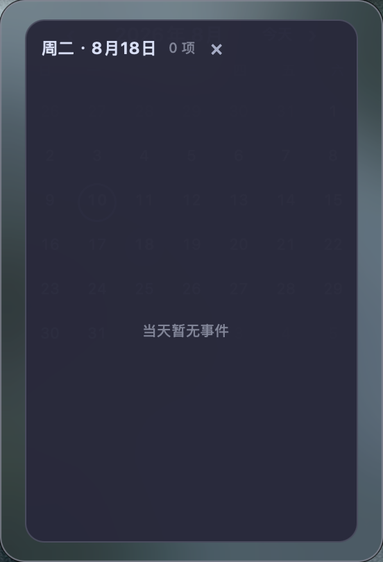
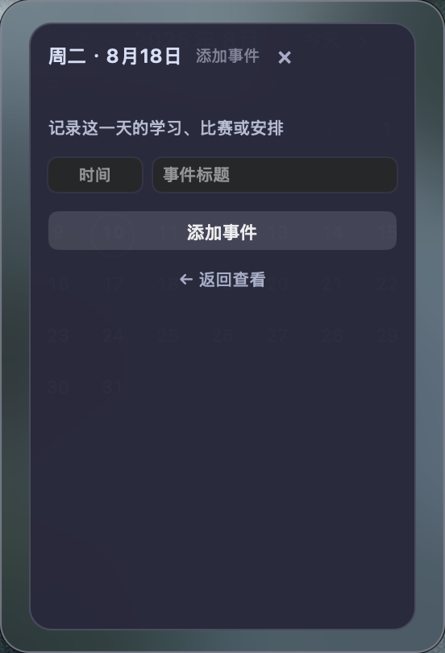

# yuttfu dotfiles

一套可迁移的 macOS 桌面环境：AeroSpace 管理窗口，SketchyBar 负责顶部状态栏，JankyBorders 为窗口绘制边框，Ghostty、状态栏与日历共用一套可切换色板。

使用 GNU Stow 管理配置链接，通过 `bootstrap.sh` 检查依赖、安装工具并恢复配置。

## 统一配色

提供八套暗色适配：JellyFish、Aurora X、poimandres、Catppuccin Mocha / Teal、Outrun Night、Synthwave x Fluoromachine、Workbench / Dark Matter 和 Amethyst Dark。

点击 SketchyBar 右侧主题按钮选择配色，或在终端运行：

```sh
terminal-theme --list
terminal-theme --current
terminal-theme jellyfish
```

色板统一保存在 [`palettes.json`](zsh/.config/terminal-themes/palettes.json)，各软件按下表应用：

| 软件 | 应用方式 |
| --- | --- |
| Ghostty | 生成终端色板后，按 `Command + Shift + ,` 重新加载。 |
| Starship / fzf | 使用所在终端的 ANSI 色板；VS Code 集成终端跟随共享主题。 |
| SketchyBar / JankyBorders | 选择主题后即时换色，保留组件状态和监测曲线。 |
| 本地日历 | 关闭面板后，下次打开时使用新配色。 |
| Obsidian | 已登记的 Vault 启用 `desktop-current` CSS 片段后自动同步。 |
| Codex | 手动导入对应主题文本。 |
| Chrome | 在目标 Profile 中手动加载对应主题目录。 |
| VS Code | 自动切换共享的 Color Theme；各 Profile 的其他设置保持独立。 |

这些是基于原主题色板的个人适配，来源与适配说明保存在色板文件中。切换配色保留字体、透明度和快捷键。详见 [桌面与终端主题说明](docs/terminal-themes.md)。

## 窗口与桌面

JankyBorders 使用 **10px 圆角边框**：活动窗口显示主题强调色，其他窗口使用低亮度边框。AeroSpace 保留自动平铺和 1–9 号模拟工作区。

macOS 原生 Spaces 的整组窗口滑动与 AeroSpace 工作区是两套机制。创建第二个桌面、使用 `Control + ←/→` 或触控板切换，以及与当前配置的使用边界，见 [Spaces 与 AeroSpace](docs/native-spaces.md)。

## 本地事件日历

日期组件打开的是无 Dock 图标的 `yuttfu Calendar.app`，不调用 Apple Calendar。查看与添加采用两个独立模式：

| 单击查看事件 | 双击添加事件 |
| --- | --- |
|  |  |
| 单击日期只进入查看事件层；没有安排时显示空状态，已有事件可在列表中逐条删除。 | 双击日期直接进入添加事件层，可填写可选时间和标题；添加成功后自动回到查看层。 |

月历使用固定 `7×6` 网格，有事件的日期显示红点。每天可保存多条“可选时间 + 标题”事件，数据只保存在：

```text
$HOME/Library/Application Support/yuttfu-sketchybar/calendar-marks.json
```

完整的 `./bootstrap.sh --apply` 会构建并安装 `$HOME/Applications/yuttfu Calendar.app`；`--links-only` 不会触发 Swift 构建。修改日历源码后也可以单独重建：

```bash
bash macos/yuttfu-calendar-panel/build-app.sh "$HOME/Applications/yuttfu Calendar.app"
```

## SketchyBar

这条顶部栏围绕学习、开发和录制设计，使用共享主题色、圆角半透明背景和刘海安全布局。所有常用信息都放在屏幕两侧，中间区域保持干净。

| 区域 | 组件 | 作用 |
| --- | --- | --- |
| 左侧 | ` yuttfu` | 打开系统设置，也是整套配置的身份标记。 |
| 左侧 | AeroSpace 工作区 | 显示 1–9 号工作区及其中的应用图标；点击数字即可切换。 |
| 左侧 | 当前应用 | 实时显示正在使用的应用，录制时也能清楚交代上下文。 |
| 右侧 | `◈ 当前主题` | 展开八套主题列表，标记当前主题并显示切换状态。 |
| 右侧 | CPU / RAM | 分开显示实时占用百分比和短曲线，高负载时才提高警示色。 |
| 右侧 | OBS | 仅在录制相关状态下提示，避免忘记录制或误以为仍在录制。 |
| 右侧 | 电池 | 电量分级图标，区分电池供电、充电、接电暂停与充满；点击查看详情。 |
| 右侧 | 日期 / 时钟 | 日期打开本地事件月历，时钟保持固定宽度以避免界面跳动。 |

## 在新 Mac 上恢复

1. 先安装 Xcode Command Line Tools 和 [Homebrew](https://brew.sh/)，然后克隆这个仓库。
2. 进入仓库，先做只读检查：

   ```bash
   ./bootstrap.sh --check
   ```

3. 检查通过后，安装依赖、创建配置链接，并恢复已记录的 VS Code 扩展：

   ```bash
   ./bootstrap.sh --apply
   ```

   安装脚本会在发现已有的用户配置与本仓库冲突时停止，不会覆盖它。若只想创建链接、且不安装 Homebrew 软件包和扩展，可使用：

   ```bash
   ./bootstrap.sh --apply --links-only
   ```

4. 首次启动 AeroSpace、SketchyBar 和 JankyBorders 时，按 macOS 的提示授予所需权限；AeroSpace 通常需要辅助功能权限。

## 电源与长任务

仓库提供可选电源档位：接电时关闭系统自动睡眠但保留 30 分钟熄屏；电池时 10 分钟熄屏、15 分钟睡眠。先查看当前值：

```bash
./macos/power.sh --check
```

先预览会执行的管理员命令：

```bash
./macos/power.sh --apply --dry-run
```

确认后再真正应用：

```bash
./macos/power.sh --apply
```

日常只希望 Codex 不中断，可以临时保持系统唤醒三个小时：

```bash
codex-awake --minutes 180
```

`bootstrap.sh` 会把这个工具链接到 `$HOME/.local/bin/codex-awake`。如果你的 shell 尚未把该目录放入 `PATH`，请直接运行 `$HOME/.local/bin/codex-awake --minutes 180`，或自行将该目录加入 shell 的 `PATH`。需要同时阻止显示器熄屏时，额外传入 `--display`；合盖和手动睡眠仍然有效。

## Ghostty 与 Visual Studio Code 透明效果

Ghostty 的主题、字体和透明度由仓库中的配置直接控制。它使用共享终端色板、MesloLGS NF、macOS regular glass 和 `0.72` 不透明度，让背景明显通透，同时通过原生模糊保持文字可读。

Visual Studio Code 底部集成终端固定为 `/bin/zsh` 登录 shell，使用 MesloLGS NF、14 号字与方块光标。shell、字体和布局等核心设置通过 `workbench.settings.applyToAllProfiles` 同步到所有 VS Code Profile，但不设置 `workbench.colorCustomizations`；终端颜色继承 VS Code 当前共享主题，Background 壁纸模拟透明效果不会被额外背景色遮挡。

由于它会改动 VS Code 的应用资源，玻璃效果必须在 VS Code 内手动确认：安装完成后打开命令面板，运行 **Vibrancy Continued: Enable Vibrancy**。VS Code 更新后若效果失效，再运行 **Vibrancy Continued: Reload Vibrancy**。这是刻意保留的显式操作，避免迁移脚本静默修改应用包。

## Zsh 与 Starship

Ghostty 和 VS Code 集成终端共用仓库中的原生 Zsh 配置，但使用两个跟随各自 ANSI 色板的 Starship 布局。Ghostty 使用两行 Powerline 提示符，常显用户名、主机名、完整目录、Shell 和时间，并按场景显示 Git、C/C++、Python、Node.js、Conda 和命令耗时；VS Code 底部终端自动切换到 `starship-vscode.toml`，只保留用户名、缩短目录、Git、Conda 和时间，避免在狭面板中拥挤。VS Code 中只要仓库存在未提交改动，就显示一个红色 `●`，仓库干净时隐藏；具体改动数量使用 `git status` 查看。

Conda 的 `base` 自动激活已经关闭，Conda 也不会自行修改提示符。进入 AI 环境时手动执行：

```bash
conda activate <环境名>
```

Starship 会显示当前环境一次。私有代理、API 配置或仅当前机器需要的路径可以放进不受 Git 管理的 `$HOME/.zshrc.local`。

当前 Mac 首次切换到仓库配置前，应先备份已有的 `.zshrc`、`.zprofile`、`.condarc` 和 `.config/starship.toml`。迁移后的文件由 Stow 链接，包括 VS Code 专用的 `.config/starship-vscode.toml`；新 Mac 执行正常的 `./bootstrap.sh --apply` 即可恢复。

## Obsidian 配色

在 [`obsidian-vaults.json`](zsh/.config/terminal-themes/obsidian-vaults.json) 登记 Vault 路径，切换一次桌面主题后，在 Obsidian 的“设置 → 外观 → CSS 代码片段”启用 `desktop-current`。默认路径指向 ACM Vault，迁移到其他机器时应按实际位置调整。

适配针对深色模式与 AnuPpuccin，保留原有布局、字体和 Style Settings；关闭片段即可恢复原主题配色。详见 [Obsidian 配色说明](docs/terminal-themes.md#obsidian-配色)。

## VS Code 自动跟随

八套主题扩展可通过扩展面板的“应用扩展到所有配置文件”共享。主题按钮更新默认 `settings.json` 中的 `workbench.colorTheme`，并将该项加入 `workbench.settings.applyToAllProfiles`。同时扫描已登记的 Profile 目录，将各份 `settings.json` 的 `workbench.colorTheme` 同步为同一个值，触发各窗口的配置更新。各自的插件、快捷键和其他设置继续独立；新建 Profile 会在下次切换时自动纳入。再次点击当前主题也会重新同步。

路径与开关保存在 [`vscode.json`](zsh/.config/terminal-themes/vscode.json)。设为 `"enabled": false` 后，主题按钮停止更新 VS Code；如果还希望各 Profile 分别选颜色，在 VS Code 设置中取消 Color Theme 的“应用设置到所有配置文件”。工作区显式指定的主题仍按 VS Code 的设置优先级处理。

主题名称映射及实现说明见 [VS Code 自动配色](docs/terminal-themes.md#vs-code-自动配色)。

## Codex 配色

顶部主题菜单提供 **复制 Codex 当前配色**，点击即可复制当前桌面主题的导入文本。八套文本也保存在 [`docs/codex-themes/`](docs/codex-themes/)。终端操作：

```sh
terminal-theme --copy-codex
```

在 Codex 的 **Settings → Appearance → Dark theme → Import** 中粘贴导入。SketchyBar 按钮不自动修改 Codex 设置，详见 [Codex 配色指南](docs/codex-themes.md)。

## Google Chrome 配色

八套原生主题保存在 [`chrome/themes/`](chrome/themes/)，与桌面共用色板。进入目标 Chrome Profile 的 `chrome://extensions`，开启开发者模式，通过“加载未打包的扩展程序”选择主题文件夹；以后更换配色时手动加载另一套目录。

主题仅调整浏览器界面与新标签页颜色，普通网页仍由网站自身主题控制。安装、切换、重新生成及恢复默认外观见 [Chrome 配色指南](chrome/README.md)。
